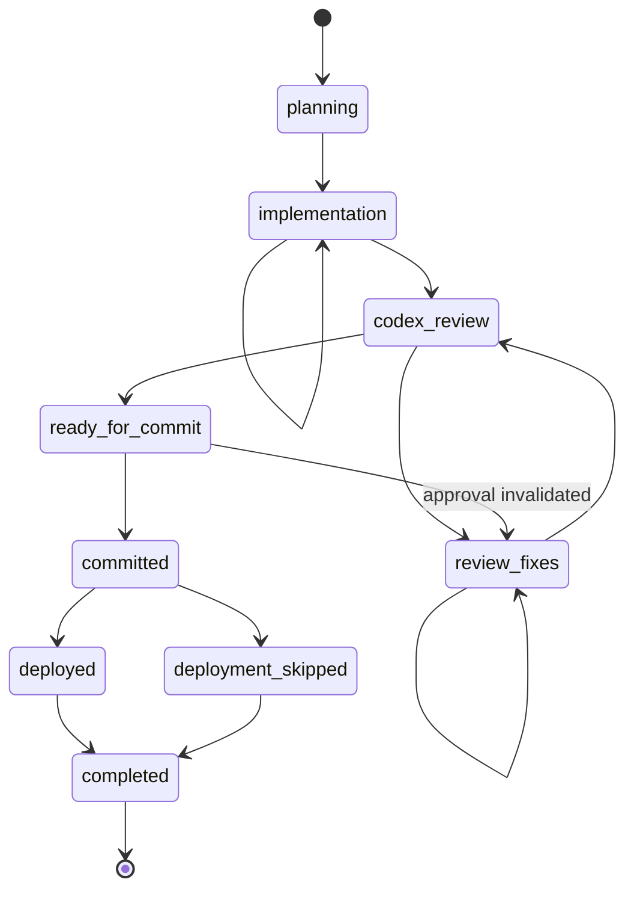

# Workflow

A task moves through nine stages. The persisted `current_stage` in
`docs/ai-context/task-workflow.json` is the authoritative logical state; Git is
used to check that the recorded state is still truthful, because Git alone
cannot tell you whether a plan was approved, whether a review passed, or
whether deployment was deliberately skipped.

## The Stages

1. **planning** — `docs/ai-context/TASK_PLAN.md` is being created and
   validated. No code
   is written here.
2. **implementation** — plan steps are executed one at a time, each
   validated before it is marked `Completed`.
3. **codex_review** — a review prompt exists for the current implementation
   fingerprint and the workflow waits for Codex's verdict.
4. **review_fixes** — findings from a `CHANGES_REQUIRED` result are being
   validated against the repository and fixed.
5. **ready_for_commit** — approval is valid and finalization has run
   (feature changelog updated, context updated if architecture changed,
   plan marked `codex_approved`).
6. **committed** — the task commit exists and was verified.
7. **deployed** / **deployment_skipped** — the deploy question was answered
   and acted on.
8. **completed** — the Arabic testing task was generated (printed in the
   terminal, not saved) and the task is closed.

## Allowed Transitions

Anything not in this table is rejected with `[TRANSITION_REJECTED]`
(exit code 5):

```text
planning         → implementation

implementation   → codex_review
implementation   → implementation      (progress checkpoint)

codex_review     → review_fixes        (CHANGES_REQUIRED)
codex_review     → ready_for_commit    (valid APPROVED + matching fingerprint)

review_fixes     → codex_review        (next round bundle created)
review_fixes     → review_fixes        (multi-finding progress)

ready_for_commit → review_fixes        (approval invalidated by a code change)
ready_for_commit → committed           (you executed the verified commit)

committed        → deployed            (verified deployment)
committed        → deployment_skipped  (you chose to skip)

deployed             → completed
deployment_skipped   → completed
```

`completed` has no outgoing transitions. A confirmed `reset` re-initializes
state and is not a transition.



## The Gates

Gates are hard checkpoints with no override flag. A failed gate stops the
workflow and prints every error with its rule identifier.

### Planning gate (planning → implementation)

The plan validates, unverified locations have been resolved or listed,
existing-feature analysis was done and recorded, a target Site is selected
(or the plan says why none is needed), and you have seen the plan —
including the list of corrections made to a plan you supplied.

### Completion gate (implementation → codex_review)

Deterministic checks (`validate completion-gate`): every plan step is
`Completed`, the stage is right, no blockers remain, the implementation
summary exists, and the secret scan over changed, staged, and untracked
files is clean.

Attested checks written into the summary: every validation actually ran and
the tests really passed, the diff contains only task-related changes, no
debug code or temporary files remain, `docs/ai-context/PROJECT_CONTEXT.md`
was updated if architecture changed, and
`docs/ai-context/FEATURE_CHANGELOG.md` has **not** been updated
yet. A skipped required step fails the gate.

### Approval gate (inside apply-review)

The result must parse as exactly `APPROVED` or `CHANGES_REQUIRED`, and an
`APPROVED` only counts when the current implementation fingerprint still
equals the one recorded when the prompt was generated.

### Finalization gate (before commit preparation)

`validate finalization-gate` checks that the approval is recorded, the
fingerprint still matches, `docs/ai-context/TASK_PLAN.md` says
`codex_approved`, and the
secret scan is clean. On top of that, the diff is checked for unrelated
changes and for unrelated files someone already staged.

## The Implementation Fingerprint

Codex approval belongs to one specific implementation state. The
fingerprint is a SHA-256 over the working-tree diff against HEAD, the
staged diff, and the sorted names and contents of untracked non-ignored
files. It contains no timestamps, so an unchanged tree always produces the
same value and any content change produces a different one.

Two directories are excluded by construction: `docs/ai-context/` (so the
plan, the workflow state, the implementation summary, the review history,
and the AI documentation never invalidate an approval)
and `.claude/` (machine-local state). Excluding them from the fingerprint
does not exclude them from secret scanning: the shared files are still
scanned before staging and completion.

That exclusion is what lets documentation finalization and state writes
happen after approval without triggering another review, while any edit to
an actual implementation file — tracked or untracked, anywhere outside
those two directories — immediately invalidates the approval and sends the
workflow back to `review_fixes`.

## The Review Loop

The prompt for round N lands at `docs/ai-context/reviews/round-NNN-prompt.md` and
contains the full plan, the implementation summary, Git status, the diffs,
the fingerprint, and an explicit instruction that Codex reviews only and
must not modify files. You run it through Codex yourself and bring the
result back with `apply-review`.

A `CHANGES_REQUIRED` result is saved verbatim as
`round-NNN-result.md` — it is never edited. Each finding is then checked
against the repository before anything is changed: valid findings are
fixed, invalid ones are refuted with file and line evidence recorded in the
summary so Codex sees the refutation in the next round, and unclear ones go
back as questions rather than guesses. Tests rerun, the summary updates, a
new fingerprint and prompt are generated, and the loop repeats until
approval.

If a finding would require a business-scope change, that is not a fix: it
goes back to planning with your awareness.

## Commit and Deployment

Commit preparation always produces the message, the exact
`git add -- <path>` commands, and the list of files deliberately excluded.
It executes only when you explicitly ask for it, then verifies that HEAD
actually moved and that the committed files match the approved task.

Deployment always begins with the deploy-or-skip question, and no SSH
connection is opened before you answer. Skipping is a normal outcome and is
recorded with its reason. Deploying runs local preflight, read-only remote
preflight, a fast-forward-only pull, and only the bench commands the
changed files actually justify — then verifies that the server HEAD equals
the task commit. Anything unexpected on the server (local changes, wrong
branch, diverged history, a failed command) stops the deployment and leaves
recovery to a human.

## Closing the Task

The testing action generates a short Arabic title and description from the
approved behavior, prints them in the terminal, and moves the workflow to
`completed`:

```text
العنوان:
<Arabic title>

الوصف:
<Arabic description>
```

Copy them into your task-management system — that is the whole purpose of
the output. **No file is written**: there is no `testing-task-ar.md` and no
replacement for it, and the generated text is not stored in the workflow
state either. What the state records is that the task was generated and
when (`testing_task.status`, `testing_task.generated_at`), which `status`
reports as `Testing task: generated (2026-07-31T13:09:37Z)`.

When deployment was skipped, a separate English warning is shown — after
the Arabic text, never inside it — telling you to publish the testing task
only once the changes reach the testing environment.

Older plugin versions saved this content to `.claude/testing-task-ar.md`
and later to `docs/ai-context/testing-task-ar.md`. Such a file is now a
legacy artifact: the plugin never reads, updates, stages, migrates, or
deletes it, and a confirmed `reset` leaves it in place. Likewise, a
`testing_task.path` in an existing workflow state still loads and is simply
ignored.
